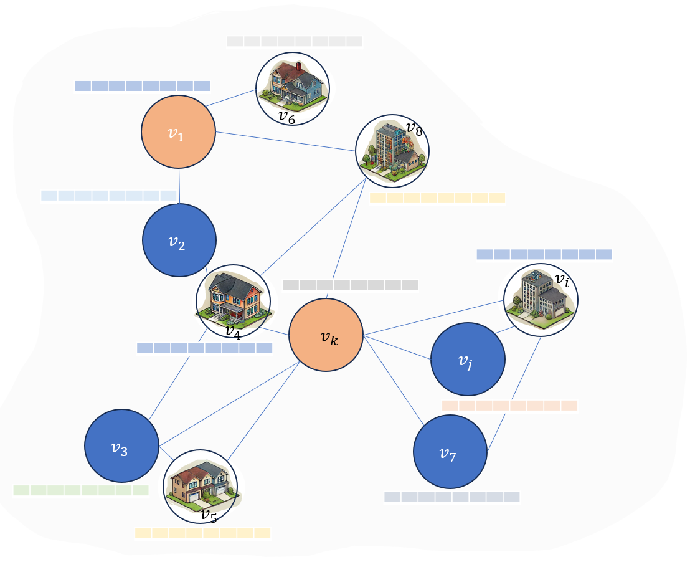
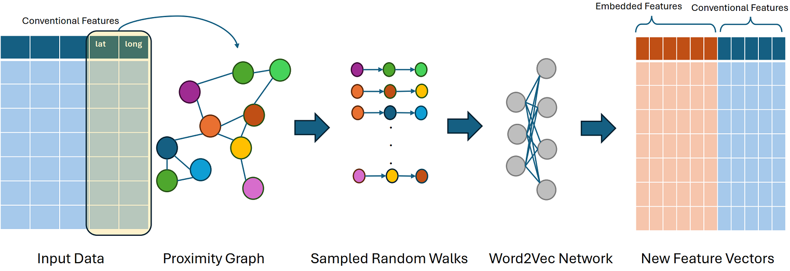
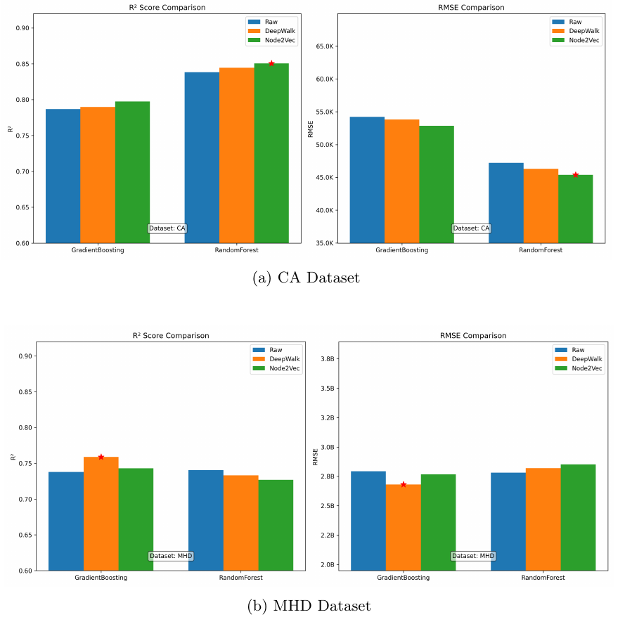

[](https://github.com/mamintoosi-papers-codes/House2Vec/archive/master.zip)
 [](https://github.com/mamintoosi-papers-codes/House2Vec/network)
[](https://github.com/mamintoosi-papers-codes/House2Vec/issues)
[](https://github.com/mamintoosi-papers-codes/House2Vec/blob/main/LICENSE)
[](https://colab.research.google.com/github/mamintoosi-papers-codes/House2Vec/blob/main/main.ipynb)

# House2Vec

House2Vec is a Python repository for **property representation learning** using **graph-based embedding methods** (DeepWalk and Node2Vec).  
The goal is to enhance **property value prediction** by capturing **spatial dependencies** among properties through network representation learning.

The repository implements the following paper:  
_"Incorporating Graph Embeddings for Enhanced Property Value Prediction"_.



---

## Abstract

Traditional property valuation models often rely on tabular features (area, rooms, age, etc.) and use latitude/longitude only as raw spatial variables. Such approaches may overlook the **structural relationships** between neighboring properties.

In this work, we construct a **proximity graph of properties**, where nodes represent properties and edges connect geographically close neighbors. Using this graph, we train **graph embeddings** with both **DeepWalk** and **Node2Vec**. These embeddings encode higher-order spatial proximity into dense vectors, which are then combined with conventional property attributes.

We evaluate ensemble regression models (Random Forest, Gradient Boosting) on two real-world datasets (California Housing and Mashhad Housing). Results show that:

- Graph embeddings can provide **useful complementary features** to standard tabular data.
- In the California dataset, Node2Vec embeddings show the strongest improvement.
- In the Mashhad dataset, DeepWalk embeddings provide the most benefit.

This demonstrates the potential of graph-based embeddings for **geospatial feature engineering** in property valuation tasks.



---

## Results



> Grouped bar charts showing the performance of regression models ($R^2$ and RMSE) with raw features, DeepWalk embeddings, and Node2Vec embeddings.

Our experiments highlight that:

- **Node2Vec** yields the best results on the California dataset (CA).
- **DeepWalk** yields the best results on the Mashhad dataset (MHD).
- In both datasets, at least one graph-embedding approach outperforms raw baseline features.

---

## Requirements

- Python 3.10
- NetworkX 3.3
- NumPy 1.24+
- Scikit-learn 1.5+
- gensim 4.3.2
- scipy 1.12
- pandas 2.2+
- matplotlib 3.8+

Install requirements via:

```bash
pip install -r requirements.txt
```

---

## Getting Started

### 1. Run in Google Colab

[](https://colab.research.google.com/github/mamintoosi-papers-codes/House2Vec/blob/main/main.ipynb)

Click the button above to open and run the notebook directly in Google Colab.

### 2. Run experiments from Jupyter Notebook

Open `main.ipynb` and execute the cells to:

- Run experiments for both datasets
- Save Excel result tables
- Generate comparison plots (\$R^2\$ and RMSE)

### 3. Run experiments from command line

Example usage:

```bash
python main_hpp.py --dataset CA --embedding_sizes 2 5 10 20
python main_hpp.py --dataset MHD --embedding_sizes 2 5 10 20
```

This performs grid search over embedding sizes, selects the best configuration, and evaluates models with raw features, DeepWalk, and Node2Vec embeddings.
Results (Excel + plots) are saved in `results/<dataset_name>/`.

---

## Data

The `data` folder contains two datasets:

1. **California-housing.csv**
   Classic California housing dataset.
2. **MHD-housing.xlsx**
   A dataset of Mashhad housing records.

Both datasets include geographic coordinates for spatial graph construction.

---

## Citation

If you use this repository in your research, please cite:

```
@article{House2Vec2025,
  title={Incorporating Graph Embeddings for Enhanced Property Value Prediction},
  author={Amintoosi, Mahmood and Ashkezari-Toussi, Soheila},
  year={2025},
  note={pre-print}
}
```
