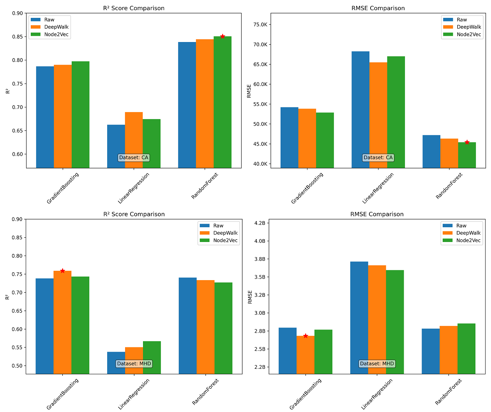

# Deepwalk-HPP

Deepwalk-HPP is a Python repository that implements house representation learning using DeepWalk, a network representation learning technique. The repository contains the code and data used in the paper "House Price Prediction Using DeepWalk".

## Abstract

This paper presents a novel approach to enhancing house price prediction by incorporating spatial information using DeepWalk. Traditional methods often rely solely on latitude and longitude as spatial features. In contrast, this study leverages DeepWalk to capture richer spatial relationships. An undirected graph is constructed by connecting houses based on a predefined geographical proximity threshold. DeepWalk generates 3-dimensional semantic vector representations for each house, encoding implicit spatial proximity information. These representations are combined with other house features (e.g., area, number of rooms, age) as input to various machine learning models, including Random Forest, Linear Regression, and Gradient Boosting. Experiments on a house price predicion dataset validate the effectiveness of the proposed method. The integration of DeepWalk-derived semantic vectors significantly improves performance, as evidenced by reductions in mean squared error and increases in correlation coefficient across models.

> The overall framework: Process for generating spatially-aware feature embeddings, combining spatial proximity graph-based Word2Vec embeddings with conventional features for enhanced feature representation.

## Results

> Grouped bar charts showing the performance of regression models (R² and MSE) with and without DeepWalk.

Our findings demonstrate that DeepWalk embeddings significantly improved the performance of Gradient Boosting and Random Forest models, enhancing their predictive accuracy and reducing errors. Gradient Boosting, in particular, showed the most substantial gains, benefiting from the enriched structural information provided by the embeddings. Random Forest also exhibited notable improvements in predictive reliability and error reduction. In contrast, Linear Regression showed only marginal benefits, reflecting its limited capacity to leverage the complex features embedded by DeepWalk.

## Requirements

- Python 3.10
- NetworkX 3.3
- NumPy 1.24+
- Scikit-learn 1.5+
- gensim 4.3.2
- scipy 1.12

## Getting Started

1. Clone the repository using `git clone https://github.com/mamintoosi/Deepwalk-HPP.git`
2. Install the required libraries by `pip install -r requirements.txt`
3. Open a Jupyter Notebook and run the cells to reproduce the experiments

## Data

The `data` folder contains two datasets:

1. **California-housing.csv**: Dataset related to California housing.
2. **MHD-housing.xlsx**: Dataset related to Mashhad (MHD) real estate.

## Usage

There are two separate Jupyter Notebooks for each dataset:

1. **DeepWalk-HPP-California.ipynb**: This notebook is used to run the analysis on the California housing dataset.
2. **DeepWalk-HPP-MHD.ipynb**: This notebook is used to run the analysis on the Mashhad (MHD) real estate dataset.

### Running the Notebooks
- Execute the corresponding notebook (`DeepWalk-HPP-California.ipynb` or `DeepWalk-HPP-MHD.ipynb`) to generate the results reported in the paper.
- The results for each dataset will be saved in the `results` folder, inside a subfolder named after the dataset (e.g., `results/California` or `results/MHD`).
